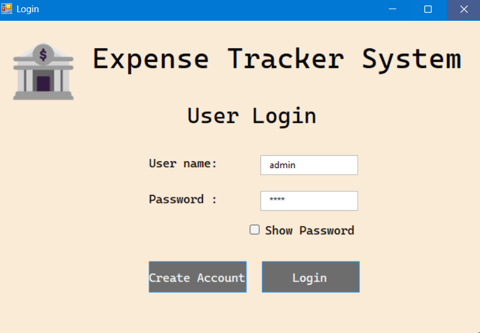
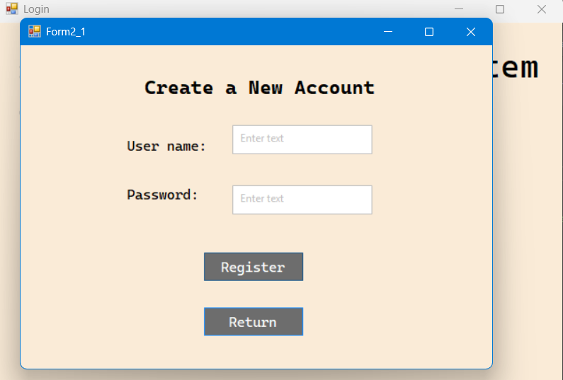
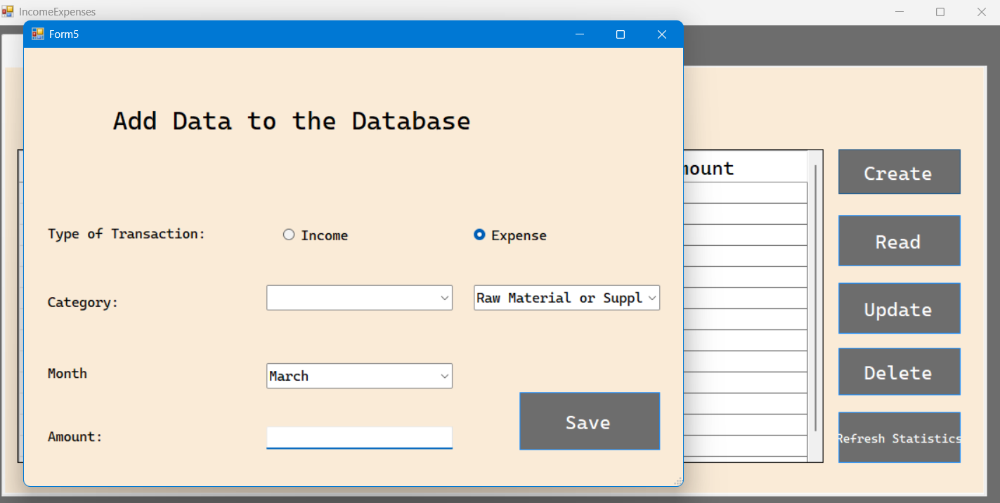
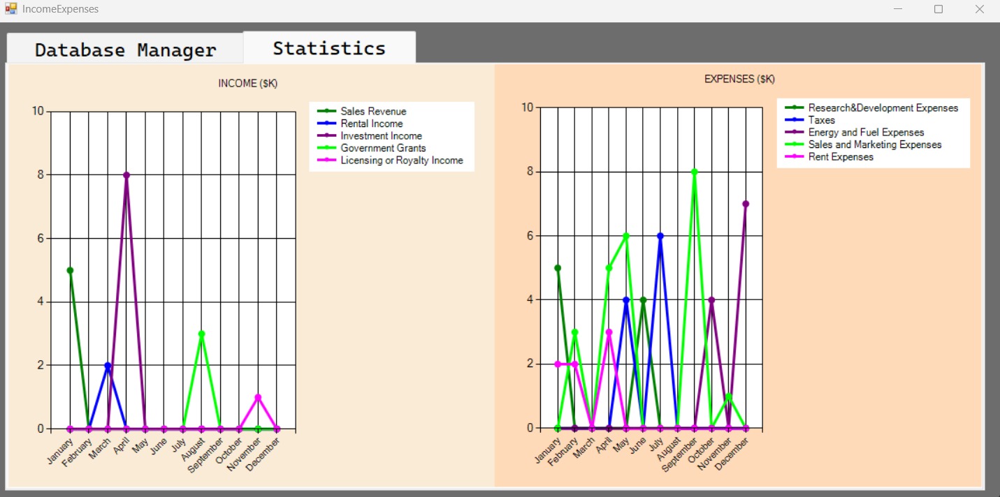

# 💰 Expense Tracker System

A comprehensive Windows Forms (WinForms) application designed to help users track their personal finances, manage incomes and expenses, and visualize financial data through dynamic charts.


## 📖 Table of Contents
- [Overview](#overview)
- [Features](#features)
- [Technology Stack](#technology-stack)
- [Screenshots](#screenshots)
- [Installation](#installation)
- [Future Roadmap](#future-roadmap)

## 🧐 Overview
The **Expense Tracker System** is a C# based desktop application that provides a user-friendly interface for database management of financial records. It allows users to perform CRUD (Create, Read, Update, Delete) operations on their financial data and provides visual insights into their spending and earning habits via integrated charts.

This project utilizes **SQLite** for lightweight, local data storage, making it portable and easy to set up.

## 🚀 Features

* **User Authentication:** Secure Login and Registration system to protect user data.
* **Dashboard Management:** A central hub to view all financial records in a tabular format.
* **CRUD Operations:**
    * **Add:** Easily input new income or expense records with categories and dates.
    * **Update:** Modify existing records directly from the dashboard.
    * **Delete:** Remove erroneous or old records.
* **Data Visualization:**
    * Dynamic charts separating **Income** and **Expenses**.
    * Visual breakdown of financial data by category (e.g., Salary, Rent, Food) and month.
* **Category Management:** predefined categories for both incomes and expenses (e.g., Sales Revenue, Personnel Expenses, etc.).

## 💻 Technology Stack

* **Language:** C#
* **Framework:** .NET Framework (Windows Forms)
* **Database:** SQLite
* **Libraries:**
    * `System.Data.SQLite` (Database Connectivity)
    * `System.Windows.Forms.DataVisualization` (Charting)

## 📸 Screenshots

### 1. User Authentication
*Secure login and new user registration screens.*

| Login Screen | Registration Screen |
| :---: | :---: |
|  |  |

### 2. Main Dashboard (Database Manager)
*The central hub where users can view, filter, and manage their transactions.*


### 3. Adding Data
*A modal interface to add new Income or Expense records with specific categories and dates.*



### 4. Financial Statistics
*Visual representation of financial health. The left chart shows Income sources, and the right chart shows Expense distribution.*



## ⚙️ Installation & Setup

1.  **Clone the repository**
    ```bash
    git clone [https://github.com/yourusername/expense-tracker.git](https://github.com/yourusername/expense-tracker.git)
    ```
2.  **Open in Visual Studio**
    * Open the `.sln` file using Visual Studio 2019 or later.
3.  **Restore NuGet Packages**
    * Right-click on the solution in the Solution Explorer.
    * Select **Restore NuGet Packages** to download the required SQLite libraries.
4.  **Run the Application**
    * Press `F5` or click the **Start** button.

## 🔮 Future Roadmap

* **Backend Modernization:** Migrating the local database architecture to a RESTful API using **ASP.NET Core** to enable multi-platform support.
* **Export Data:** Feature to export financial reports to Excel (.xlsx) or PDF formats.
* **Budget Limits:** Implementing monthly spending limits and alert systems for specific categories.
